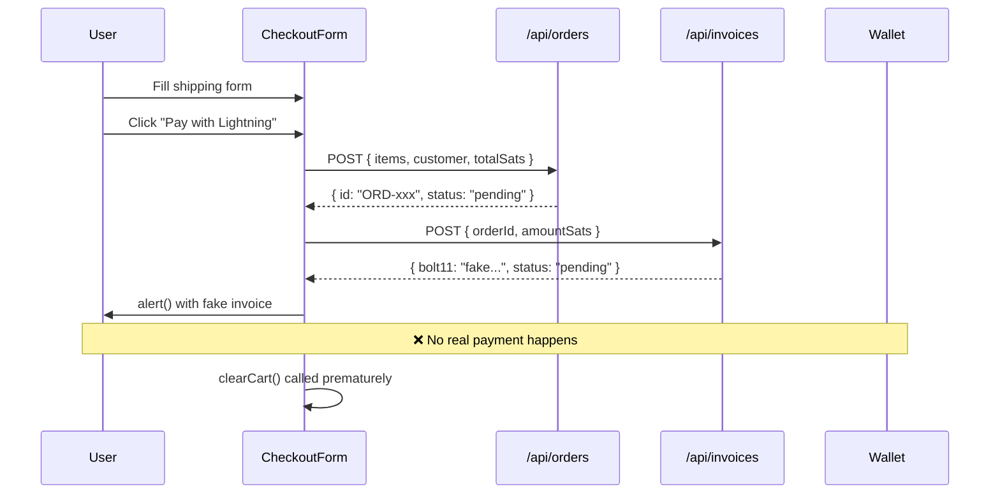
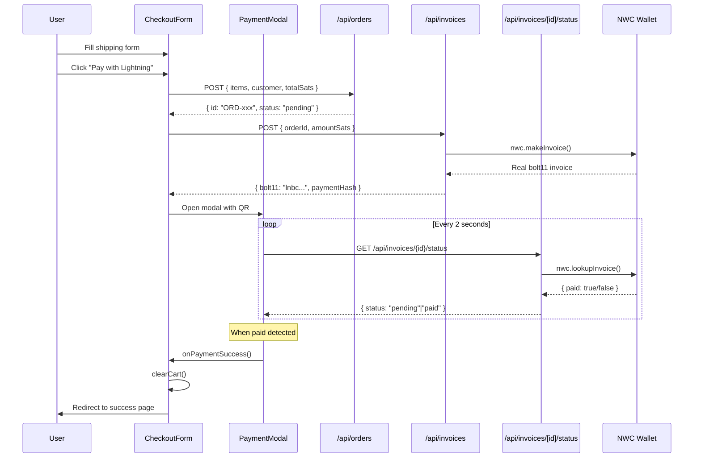

# 02 - Architecture Map

> Generated by Architect Agent | Lightning Payment Pipeline
> Project: PROOF-OF-WEAR
> Date: 2026-01-16

---

## 1. Current Payment Flow



### Problems with Current Flow
1. Invoice is fake (not NWC)
2. No QR code display
3. No payment status checking
4. Cart cleared before payment confirmation
5. No payment success page

---

## 2. Target Payment Flow



---

## 3. Integration Points Map

### 3.1 Files to MODIFY

| File | Lines | What to Change |
|------|-------|----------------|
| `src/app/api/invoices/route.ts` | 44-57 | Replace fake bolt11 with real NWC `makeInvoice()` |
| `src/components/checkout/CheckoutForm.tsx` | 81-88 | Replace `alert()` with PaymentModal |
| `src/types/index.ts` | 69-87 | Add `paymentHash` to lookup, add `PaymentStatus` type |

### 3.2 Files to CREATE

| File | Purpose |
|------|---------|
| `src/app/api/invoices/[id]/status/route.ts` | GET endpoint to check payment status via NWC |
| `src/components/checkout/PaymentModal.tsx` | Modal with QR code, countdown, status polling |
| `src/app/checkout/success/page.tsx` | Payment success confirmation page |
| `src/lib/nwc.ts` | NWC client singleton (server-side) |
| `.env.example` | Document required environment variables |

### 3.3 Files to KEEP (no changes needed)

| File | Reason |
|------|--------|
| `src/app/api/orders/route.ts` | Order creation is fine as-is |
| `src/lib/store.ts` | Cart state management is complete |
| `src/lib/products.ts` | Already has 1-sat product (Propaganda Pack) |

---

## 4. Detailed Integration Points

### 4.1 Invoice API (`src/app/api/invoices/route.ts`)

**Current Code (lines 44-57):**
```typescript
// For demo: generate a fake bolt11 invoice
const fakeBolt11 = `lnbc${body.amountSats}n1pjexampleinvoice${Date.now()}`;

const invoice = {
  invoiceId,
  orderId: body.orderId,
  bolt11: fakeBolt11,
  paymentHash: `hash_${invoiceId}`,
  // ...
};
```

**Target Code:**
```typescript
import { nwc } from '@getalby/sdk';

// Initialize NWC client
const client = new nwc.NWCClient({
  nostrWalletConnectUrl: process.env.NWC_URL!
});

// Create real invoice
const transaction = await client.makeInvoice({
  amount: body.amountSats * 1000, // millisats
  description: `Order ${body.orderId}`,
  expiry: 600, // 10 minutes
});

const invoice = {
  invoiceId,
  orderId: body.orderId,
  bolt11: transaction.invoice,
  paymentHash: transaction.payment_hash,
  // ...
};
```

### 4.2 Checkout Form (`src/components/checkout/CheckoutForm.tsx`)

**Current Code (lines 81-88):**
```typescript
const invoice = await invoiceResponse.json();

// For demo: show alert with invoice info
alert(`Lightning Invoice Generated!\n\nBolt11: ${invoice.bolt11?.substring(0, 50)}...\n\nAmount: ${total} sats`);

// Clear cart after successful order
clearCart();
```

**Target Code:**
```typescript
const invoice = await invoiceResponse.json();

// Open payment modal
setShowPaymentModal(true);
setCurrentInvoice(invoice);

// DON'T clear cart yet - wait for payment confirmation
```

### 4.3 New Status Endpoint (`src/app/api/invoices/[id]/status/route.ts`)

```typescript
import { nwc } from '@getalby/sdk';
import { NextRequest, NextResponse } from 'next/server';

export async function GET(
  request: NextRequest,
  { params }: { params: Promise<{ id: string }> }
) {
  const { id } = await params;

  const client = new nwc.NWCClient({
    nostrWalletConnectUrl: process.env.NWC_URL!
  });

  // Lookup invoice by payment_hash (stored from creation)
  const result = await client.lookupInvoice({
    payment_hash: id
  });

  return NextResponse.json({
    invoiceId: id,
    status: result.preimage ? 'paid' : 'pending',
    paidAt: result.preimage ? new Date().toISOString() : null,
  });
}
```

---

## 5. Data Flow Diagram

```
┌─────────────────────────────────────────────────────────────────┐
│                         FRONTEND                                 │
├─────────────────────────────────────────────────────────────────┤
│                                                                 │
│  ┌──────────────┐    ┌──────────────┐    ┌──────────────┐      │
│  │ CheckoutForm │───>│ PaymentModal │───>│ SuccessPage  │      │
│  │              │    │              │    │              │      │
│  │ - Form data  │    │ - QR code    │    │ - Confirm    │      │
│  │ - Submit     │    │ - Countdown  │    │ - Order ID   │      │
│  │              │    │ - Polling    │    │              │      │
│  └──────┬───────┘    └──────┬───────┘    └──────────────┘      │
│         │                   │                                   │
└─────────┼───────────────────┼───────────────────────────────────┘
          │                   │
          ▼                   ▼
┌─────────────────────────────────────────────────────────────────┐
│                          BACKEND                                 │
├─────────────────────────────────────────────────────────────────┤
│                                                                 │
│  ┌──────────────┐    ┌──────────────┐    ┌──────────────┐      │
│  │ /api/orders  │    │/api/invoices │    │/api/invoices │      │
│  │              │    │              │    │ /[id]/status │      │
│  │ POST         │    │ POST         │    │ GET          │      │
│  │ Create order │    │ Create inv   │    │ Check status │      │
│  └──────────────┘    └──────┬───────┘    └──────┬───────┘      │
│                             │                   │               │
└─────────────────────────────┼───────────────────┼───────────────┘
                              │                   │
                              ▼                   ▼
┌─────────────────────────────────────────────────────────────────┐
│                        NWC (External)                            │
├─────────────────────────────────────────────────────────────────┤
│                                                                 │
│  ┌──────────────────────────────────────────────────────┐      │
│  │               @getalby/sdk NWCClient                  │      │
│  │                                                       │      │
│  │  makeInvoice() ──────────> Lightning Invoice          │      │
│  │  lookupInvoice() ────────> Payment Status             │      │
│  │                                                       │      │
│  └──────────────────────────────────────────────────────┘      │
│                              │                                  │
│                              ▼                                  │
│                    ┌─────────────────┐                         │
│                    │   Alby Hub or   │                         │
│                    │  Alby Account   │                         │
│                    │  (Lightning)    │                         │
│                    └─────────────────┘                         │
│                                                                 │
└─────────────────────────────────────────────────────────────────┘
```

---

## 6. Environment Variables Required

```env
# NWC Connection String (from Alby Hub or Alby Account)
# Format: nostr+walletconnect://[pubkey]?relay=[relay]&secret=[secret]
NWC_URL=

# Optional: For test wallets in E2E testing
NWC_TEST_WALLET_A=
NWC_TEST_WALLET_B=
```

---

## 7. Component Hierarchy

```
src/
└── components/
    └── checkout/
        ├── CheckoutForm.tsx      # MODIFY: Add PaymentModal integration
        ├── PaymentModal.tsx      # CREATE: QR + polling + countdown
        └── index.ts              # UPDATE: Export PaymentModal

src/
└── app/
    ├── checkout/
    │   ├── page.tsx              # OK: Uses CheckoutForm
    │   └── success/
    │       └── page.tsx          # CREATE: Success confirmation
    └── api/
        └── invoices/
            ├── route.ts          # MODIFY: Use real NWC
            └── [id]/
                └── status/
                    └── route.ts  # CREATE: Status check endpoint
```

---

## 8. Test Product (Already Exists!)

The **Propaganda Pack** stickers are already priced at **1 sat**:

```typescript
// src/lib/products.ts, lines 24-36
{
  id: 'stickers-propaganda',
  slug: 'propaganda-pack',
  name: 'Propaganda Pack',
  priceInSats: 1,  // ← Perfect for testing!
  category: 'accessories',
  inStock: true,
  featured: true,
}
```

No need to create a separate test product.

---

## 9. Summary: Implementation Scope

| Category | Action | Files |
|----------|--------|-------|
| **Modify** | Replace fake with real NWC | 3 files |
| **Create** | New components/endpoints | 4 files |
| **Configure** | Environment variables | 1 file |
| **Keep** | No changes needed | 4+ files |

### Estimated Commits
1. `feat(lib): add NWC client singleton`
2. `feat(api): implement real NWC invoice creation`
3. `feat(api): add invoice status endpoint`
4. `feat(types): extend payment types`
5. `feat(ui): create PaymentModal component`
6. `feat(checkout): integrate payment modal`
7. `feat(pages): add checkout success page`
8. `feat(i18n): add payment-related translations`

---

## Ready for Phase 3

Architecture mapped. Next: Research payment implementation options with Socrates.
