# Lightning Payment Pipeline - Orchestration Flow

This document explains the multi-agent orchestration flow that transforms a basic e-commerce website into a fully functional shop with Bitcoin Lightning payments via NWC (Nostr Wallet Connect).

## Overview

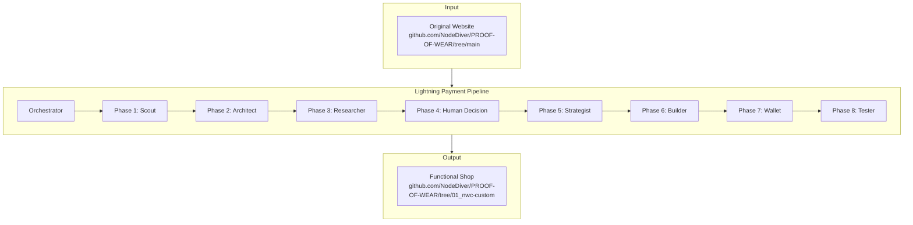

## Agent Flow Sequence

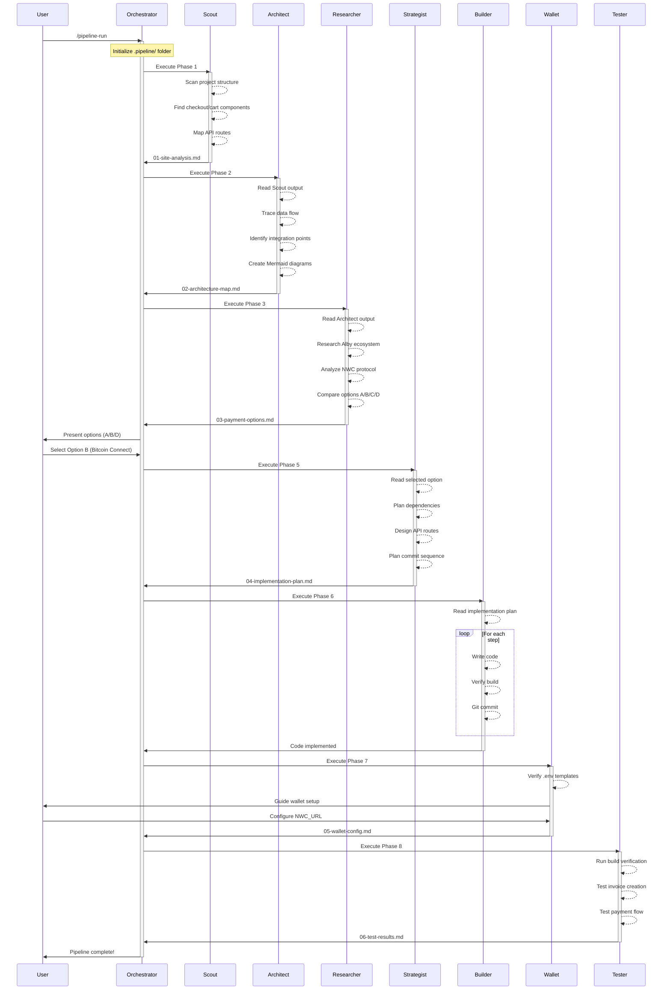

## Phase Details

### Phase 1: Scout Agent

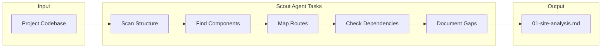

**Analyzes:**
- Framework (Next.js 15, React 19)
- Project structure
- Checkout/cart components
- API routes
- i18n configuration
- Existing payment dependencies

### Phase 2: Architect Agent

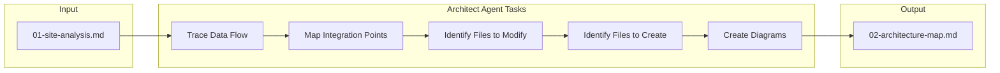

**Produces:**
- Current vs Target flow diagrams
- Files to MODIFY with line numbers
- Files to CREATE list
- Environment variables needed

### Phase 3: Researcher Agent

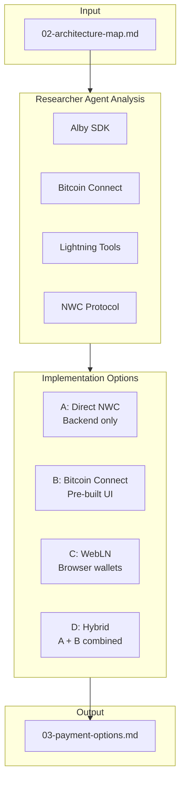

### Phase 4: Human Decision Point

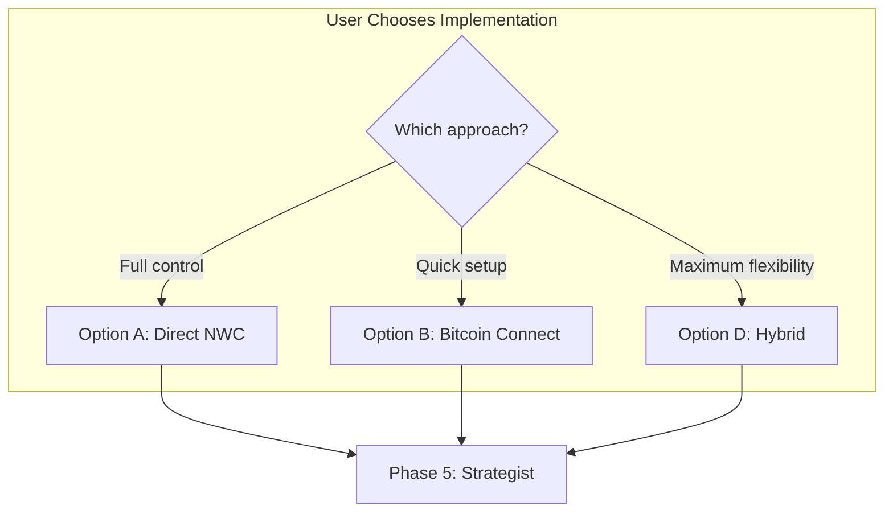

### Phase 5: Strategist Agent

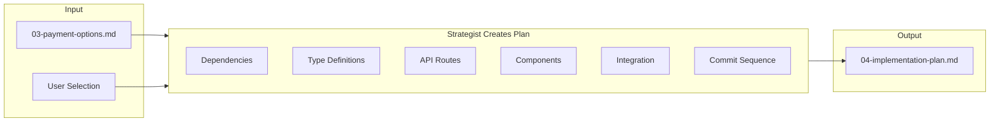

### Phase 6: Builder Agent

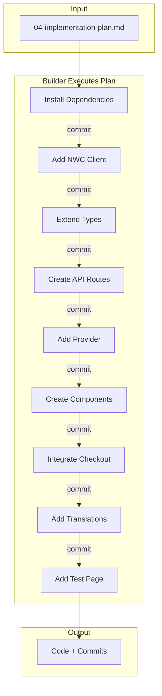

### Phase 7: Wallet Agent

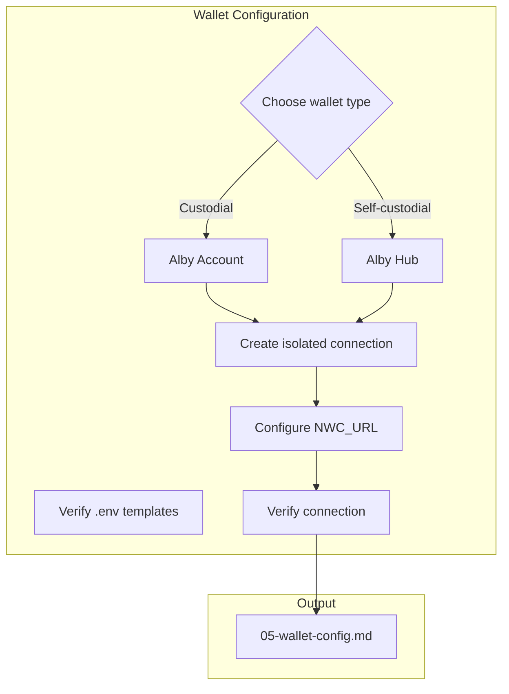

### Phase 8: Tester Agent

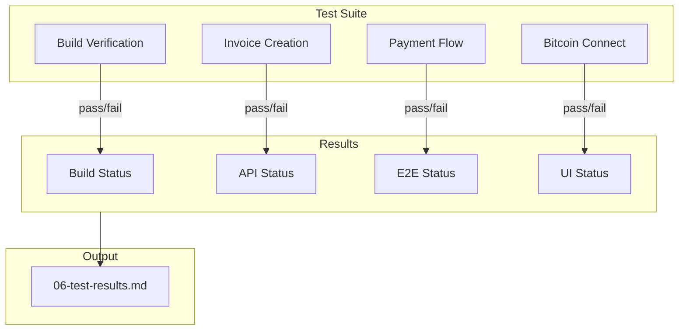

## Data Flow: Product to Payment

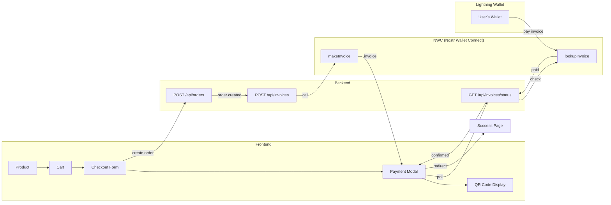

## File Generation Timeline

```mermaid
gantt
    title Pipeline Execution Timeline
    dateFormat X
    axisFormat %s

    section Phase 1
    Scout Analysis           :p1, 0, 1
    01-site-analysis.md      :milestone, m1, after p1, 0

    section Phase 2
    Architecture Mapping     :p2, after m1, 1
    02-architecture-map.md   :milestone, m2, after p2, 0

    section Phase 3
    Options Research         :p3, after m2, 1
    03-payment-options.md    :milestone, m3, after p3, 0

    section Phase 4
    Human Decision           :p4, after m3, 0.5

    section Phase 5
    Implementation Planning  :p5, after p4, 1
    04-implementation-plan.md :milestone, m5, after p5, 0

    section Phase 6
    Code Implementation      :p6, after m5, 3
    Git Commits              :milestone, m6, after p6, 0

    section Phase 7
    Wallet Configuration     :p7, after m6, 1
    05-wallet-config.md      :milestone, m7, after p7, 0

    section Phase 8
    Testing                  :p8, after m7, 1
    06-test-results.md       :milestone, m8, after p8, 0
```

## Repository Transformation

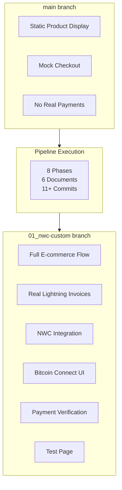

## Summary

The Lightning Payment Pipeline transforms any Next.js e-commerce project into a Bitcoin Lightning-enabled shop through:

1. **Automated Analysis** - Scout and Architect agents understand your codebase
2. **Informed Decisions** - Researcher presents options with trade-offs
3. **Human Control** - You choose the implementation approach
4. **Systematic Implementation** - Builder follows atomic commits
5. **Security Focus** - Wallet agent emphasizes isolated connections
6. **Verified Results** - Tester confirms everything works

**Source Repository:** https://github.com/NodeDiver/PROOF-OF-WEAR/tree/main
**Result Repository:** https://github.com/NodeDiver/PROOF-OF-WEAR/tree/01_nwc-custom
